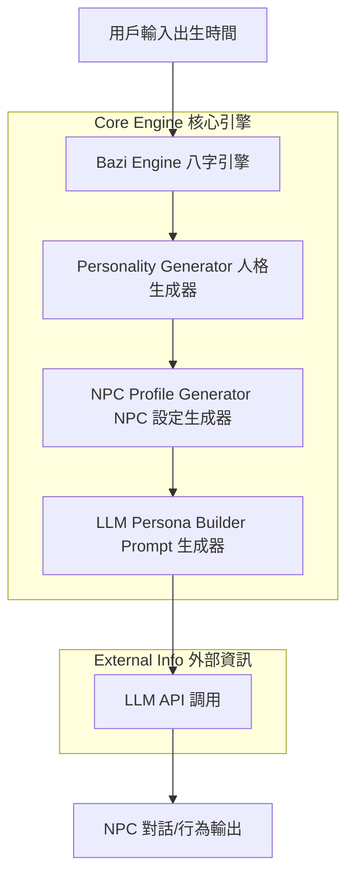
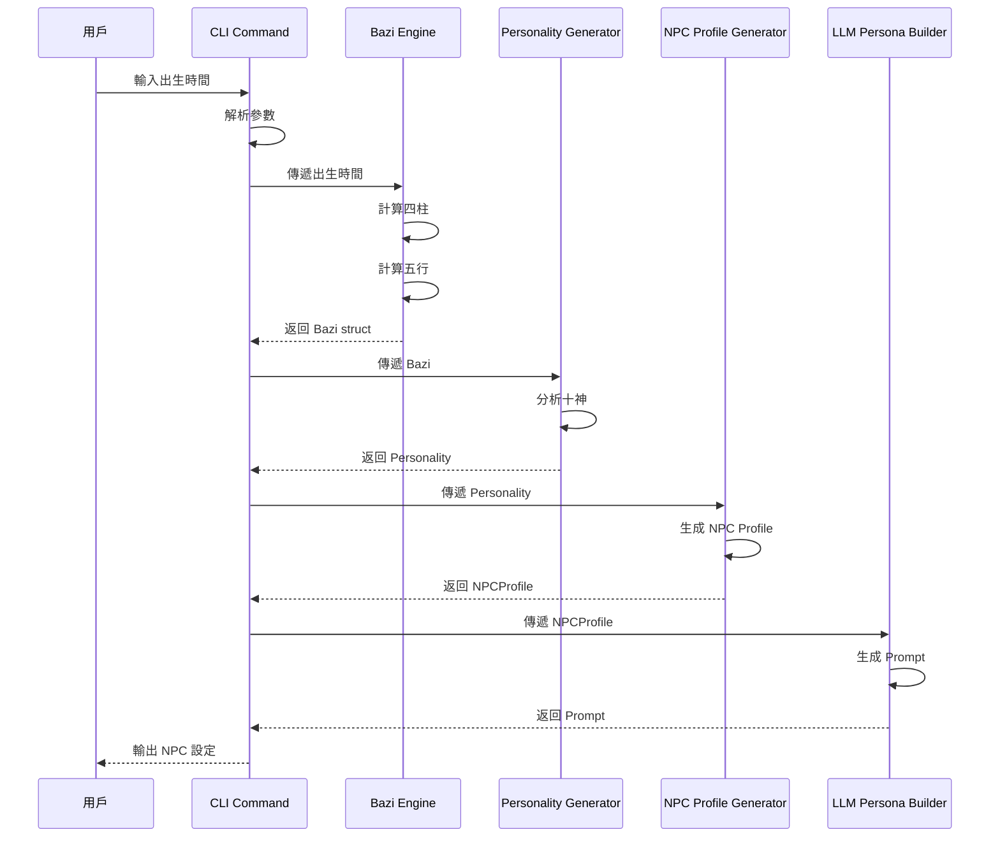

# 架構設計文檔 (Architecture Design)

> 📦 **預覽須知**：本圖使用 Mermaid 語法繪製。若在 VS Code 中看不到圖示，
> 請安裝擴充套件 [Markdown Preview Mermaid Support](https://marketplace.visualstudio.com/items?itemName=bierner.markdown-mermaid)
> （搜尋 `bierner.markdown-mermaid`）後，重新開啟 Markdown Preview 即可正常顯示。

## 1. 系統架構 (System Architecture)



## 2. 模組_design (Module Design)

### 2.1 Bazi Engine (八字引擎)

**功能**：將出生時間轉換為八字盤

```
輸入: 出生時間 (DateTime, Timezone)
輸出: Bazi struct {
    Year  string # 年柱
    Month string # 月柱
    Day   string # 日柱
    Hour  string # 時柱
    Elements map[string]float64 # 五行比例
    TenGods  map[string]string   # 十神分析
}
```

**核心邏輯**：
1. 計算四柱（年/月/日/時）
2. 計算五行Strength (金木水火土)
3. 分析十神（比肩、劫財、食神、傷官等）
4. 計算大運與流年

### 2.2 Personality Generator (人格生成器)

**功能**：從八字盤生成人格特徵

```
輸入: Bazi struct
輸出: Personality struct {
    Traits     []string   # 人格特質
    Strengths  []string   # 優點
    Weaknesses []string   # 缺點
    Behavior   []string   # 行為模式
}
```

**核心邏輯**：
- 五行平衡 → 核心性格
- 日主強弱 → 自信心水平
- 十神组合 → 人際模式

### 2.3 NPC Profile Generator (NPC 設定生成器)

**功能**：生成完整 NPC 設定

```
輸入: Personality struct + 隨機種子
輸出: NPCProfile struct {
    Name        string   # 角色姓名
    Age         int      # 年齡
    Occupation  string   # 職業
    Personality []string # 總結描述
    Background  string   # 背景故事
    LifeEvents  []string # 重要事件
}
```

### 2.4 LLM Persona Builder (LLM Prompt 生成器)

**功能**：生成 LLM 可使用的 Persona Prompt

```
輸入: NPCProfile struct
輸出: string # Prompt 文本
```

**Prompt 格式**：
```
You are an NPC with the following characteristics:

Name: [Name]
Age: [Age]
Occupation: [Occupation]

Personality:
- [Trait 1]
- [Trait 2]

Background:
[Background Story]

Behavior Guidelines:
[Behavior Patterns]

Please respond as this character.
```

## 3. 資料流 (Data Flow)



## 4. 模組依賴 (Module Dependencies)

```
cmd/
└── main.go (CLI 入口)
    └── internal/bazi/ (八字引擎)
        └── 純數學計算，無外部依賴
    └── internal/personality/ (人格生成)
        └── internal/bazi/ (依賴八字引擎)
    └── internal/npc/ (NPC 生成)
        └── internal/personality/ (依賴人格生成器)
    └── internal/llm/ (LLM Prompt)
        └── internal/npc/ (依賴 NPC 生成器)
```

## 5. 技術決策 (Tech Decisions)

| 決策 | 選擇 | 理由 |
| :--- | :--- | :--- |
| 語言 | Go 1.23 | 性能高、單一執行檔、易部署 |
| 架構 | Clean Architecture | 標準目錄結構、易測試、可維護 |
| 八字計算 | 純數學計算 | Deterministic、無外部 API 依賴 |
| LLM 整合 | API Client | 支援多種 LLM 提供者 |
